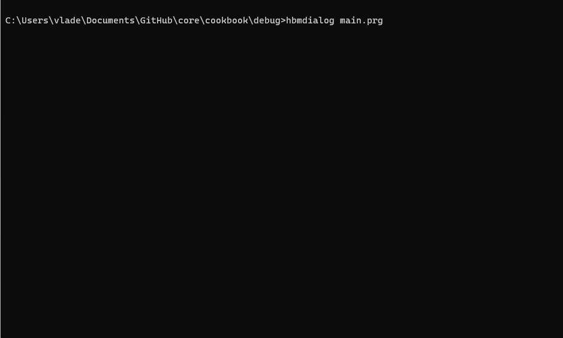
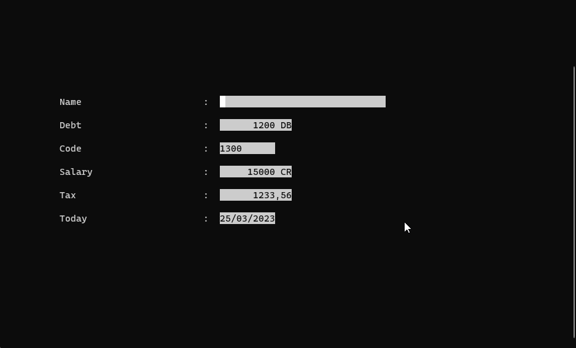
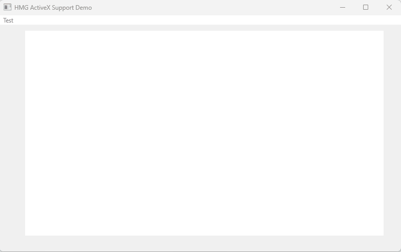
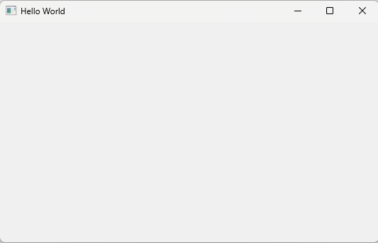
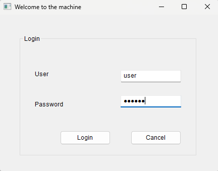
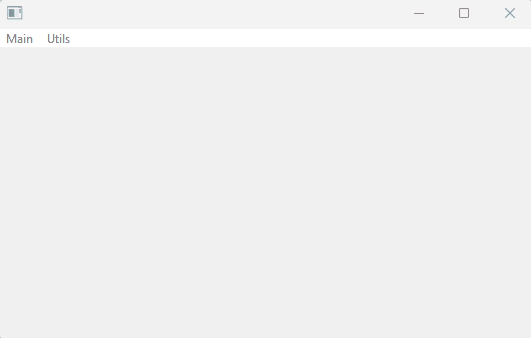
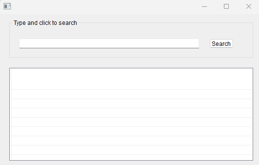
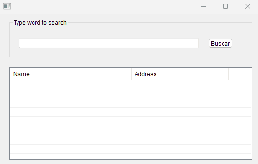
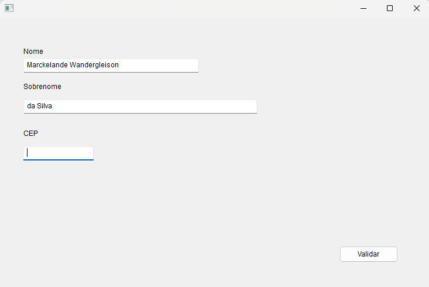
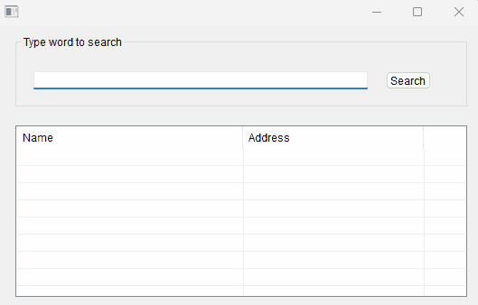

# Hbmshell cookbook 

## 🚀 Basic

### Variables

1. [How to attrib value to variable (Dbase Legacy mode)](./attrib01/main.prg)
1. [How to attrib value to variable (Harbour mode)](./attrib02/main.prg)
1. [How to determine if a given name is a PUBLIC or PRIVATE memory variable - using function](./var/main.prg)
1. [How to determine if a PUBLIC or PRIVATE var exists - using function](./var02/main.prg)
1. [How to release value of a PUBLIC or PRIVATE var from memory (attrib NIL)  - using function](./var03/main.prg)
1. [How to release ALL variables PUBLIC or PRIVATE from memory  - using function](./var04/main.prg)
1. [How to determine a variable's scope (PUBLIC or PRIVATE)  - using function](./var05/main.prg)
1. [How to CREATE a variable PUBLIC or PRIVATE  - using function](./var06/main.prg)
1. [How to PUT a value in a variable PUBLIC or PRIVATE  - using function](./var07/main.prg)
1. [Whats happens when a variable LOCAL/STATIC has the same name a variable PRIVATE/PUBLIC  - using function](./var08/main.prg)
1. [Pass variables by reference (many procedures)](./byref/main.prg)

### Data types

1. [How to convert a string to number](./convert01/main.prg)
1. [How to convert a number to string](./convert02/main.prg)
1. [How to convert a number to string and place leading zeros](./convert03/main.prg)
1. [How to convert a date to string](./convert04/main.prg)
1. [How to convert a date to string with format personalized](./hbDTOC/main.prg)
1. [How to convert any value to string](./convert05/main.prg)
1. [How to convert a number value to string (Without spaces around number)](./hb_ntos/main.prg)

### Numeric

1. [How to rounds up a number to the next integer](./ceiling/main.prg)
1. [How to rounds down a number to the next integer](./floor/main.prg)

### Strings

1. [How to extract blank spaces around the string](./alltrim/main.prg)
1. [How to select chars inside string](./CharOnly/main.prg)
1. [How to convert string delimited in a array](./explode/main.prg)
1. [How to get caracter 'N' in string delimited by 'K'](./tokenget/main.prg)
1. [How to search and replace word inside a string](./rtf/main.prg)
1. [How to search and replace all caracters at right of string](./replright/main.prg)
1. [How to format a string using %1 ... %9 parameters](./strformat/main.prg) 
1. [How to format a string like a printf C function](./convert06/main.prg)
1. [How to format a string according PICTURE function](./transform/main.prg) -- Tip: See Get/Say commands

### Date and Time

1. [How to calculete difference between two moments in time](./elaptime/main.prg)
1. [How to get actual hour, minutes and seconds](./time/main.prg)
1. [How to calculate an age in years, months and days](./age/main.prg)
1. [How to get a seconds elapsed between two instants](./seconds/main.prg)
1. [How to get a miliseconds elapsed between two instants](./miliseconds/main.prg)
1. [How to get a week number of year](./hb_week/main.prg)
1. [How to add days a date](./addDays/main.prg)
1. [How to add months a date](./addMonths/main.prg)
1. [How to get begin of month](./bom/main.prg)
1. [How to get end of month](./eom/main.prg)
1. [How to get begin of quater](./boq/main.prg)
1. [How to get end of quater](./eoq/main.prg)
1. [How to get begin of year](./boy/main.prg)
1. [How to get end of year](./eoy/main.prg)
1. [Returns the date as a string in DD Month YY format](./dmy/main.prg)
1. [Determines the day of the year for a specific date](./doy/main.prg)
1. [How to determines of year of date is a leap year](./leap/main.prg)
1. [How to determines the number of days in the month.](./lastdayom/main.prg)
1. [Returns the date as a string in Month DD, YY or Month DD, YYYY](./mdy/main.prg)
1. [Returns a number equal to the quarter in which a date falls](./quarter/main.prg)
1. [Determines whether a specified time is valid](./timevalid/main.prg)
1. [How to iterate during N/100 seconds (after this exit loop)](./waitperiod/main.prg)
1. [How to build date in format MONTHNAME N YYYY HH:MM:SS (f.e: May 5 2016 10:04:52)](./buildDate/main.prg)

### Comments

1. [How to comment your code](./comment/main.prg)
1. [How to comment your code (Dbase legacy)](./comment02/main.prg)

### Arrays

1. [How to declare, initialize and fill arrays](./array01/main.prg)
1. [How to iterate in array (an example with for loop)](./array02/main.prg)
1. [Create an array dinamically (with ARRAY() function)](./array03/main.prg)
1. [Create an array dinamically (with AADD() function)](./array04/main.prg)
1. [Whats difference between arrays initializate in line and arrays initializates in differents lines](./array05/main.prg)
1. [How to compare two arrays](./array06/main.prg)
1. [Arrays are always passed by reference](./array07/main.prg)
1. [Array element are permanent changed inside functions](./array08/main.prg)
1. [An array element passed to function is equal to any variable](./array09/main.prg)
1. [Returning arrays from functions](./array10/main.prg)
1. [How to iterate in array (an example with foreach)](./array11/main.prg)
1. [How to iterate in array (an example with foreach) - Pay atention to extra loop properties](./array12/main.prg)
1. [How to iterate in array (an example with foreach) - Pay atention to extra loop properties](./array13/main.prg)
1. [How to use change array size](./array14/main.prg)
1. [How to convert string delimited in a array](./explode/main.prg)
1. [How to delete array element](./adel/main.prg)
1. [How to insert array element](./ains/main.prg)
1. [How to save/restore arrays to/from disk](./arraymem/main.prg)

### Hashs (associative arrays)

1. [How to create a hash](./hash01/main.prg)
1. [How to create a hash (method 2: by function)](./hash02/main.prg)
1. [How to search content in hash (like a Ascan)](./hscan/main.prg)

### Codeblock

1. [Did you know that an element inside a codeblock is created in compiled time, but is avaliated only in runtime.](./bloco01/main.prg)
1. [Did you know that an element inside a codeblock is created in compiled time, but is avaliated only in runtime (II).](./bloco02/main.prg)
1. [How to create a extended codeblock.](./bloco03/main.prg)
1. [Whats difference between standard codeblock and extended codeblock.](./bloco04/main.prg)
1. [How to execute a routine inside extended codeblock.](./bloco05/main.prg)
1. [How to create a codeblock in runtime.](./bloco06/main.prg)

### Conditional

#### IF

1. [How to create a simple IF](./if01/main.prg)
1. [How to create a simple IF / ELSE](./if02/main.prg)
1. [How to create nested IF](./if03/main.prg)
1. [How to create many IFs in same level](./if04/main.prg)
1. [How to create a CASE statement (many IFs)](./if05/main.prg)

#### Switch

1. [How to create a simple SWITCH](./switch01/main.prg)

### Loops

#### For each

1. [Loop For each example with string](./foreach00/main.prg)
1. [Loop For each example and variable value outside loop not change](./foreach01/main.prg)
1. [Loop For each example (String passed by reference / Change value)](./foreach02/main.prg)
1. [Loop For each example with array](./foreach03/main.prg)
1. [Exit For each Loop example with array](./foreach04/main.prg)
1. [Loop For each example with array and strings](./foreach05/main.prg)
1. [Loop For each example with hash](./foreach06/main.prg)

#### Others

1. [How  to  implement a FOR…NEXT loop implementation in a single line](./hbfornext/main.prg)

### Pre-compiler

1. [How to declare variable in compile time](./define/main.prg)
1. [How to execute code according platform](./define_platform/main.prg)
1. [How to create pseudo command according variable defined in compile time (variable is in external file .ch)](./define2/main.prg)
1. [How to create pseudo command according variable defined in compile time (variable is in external file .ch - detail: this file is not in O.S. PATH)](./define3/main.prg)
1. [How to see content file text](./pragma/main.prg)
1. [How to copy a binary file](./stream/main.prg)
1. [How to create your own commands](./command/main.prg)
1. [How to activate debug mode (using hbmdialogdbg)](./debug/main.prg)
 

### Random

1. [How to generate random number without repetitions](./sorteio/main.prg)
1. [How to generate random integer number](./randomInt/main.prg)

### Error control

1. [How to change my error controller](./errorControl01/main.prg)
1. [How to create error control standard](./errorControl02/main.prg)

### Macro

1. [How to expand code with macro](./macro/main.prg)

### Run time system

1. [How to execute a code inside variable](./compileFromBuff01/main.prg)
1. [How to execute a code inside external file](./compileBuff01/main.prg)
1. [How to load and execute a code inside hrb file](./hrb/)

### OOP

1. [How to create a simple class](./oop01/main.prg)
1. [How to use WITH OBJECT statement in a object](./oop02/main.prg)
1. [How to use WITH OBJECT statement in a TBrowse object](./with/main.prg)

### Pointer

1. [How to call a function through a pointer](./pointer/main.prg)

### RegExp

1. [How to match any caracter in regexp](./regexp_DOT/main.prg)
1. [How to match many caracters in regexp](./regexp_LIST/main.prg)
1. [How to negate specific word in regex](./regexp_DENYLIST/main.prg)
1. [How to find one or more characters regardless of the previous character](./regexp_Optional/main.prg)
1. [How to find one or more characters that can appear in any quantity](./regexp_AnyQuant/main.prg)
1. [How to get content inner tags](./innertags/main.prg)
1. [How to valid e-mail address](./regex_Email/main.prg)

### Codepage

1. [How to list all codepages availables](./cdpList/main.prg)
1. [Warning: order change after switch current codepage to another](./cdpSelect/main.prg)

### Routines (Procedures or Functions)

1. [How to get routine name](./Procname/main.prg)
1. [How to get parameters passed in command line](./acmdline/main.prg)
1. [How to pass unlimited parameters to routine](./params/main.prg)
1. [How to attrib default value to parameter (hb_Default)](./default/main.prg)
1. [How to attrib default value to parameter II (hb_DefaultValue)](./default2/main.prg)
1. [How to attrib default value to parameter III (Clipper Legacy)](./default3/main.prg)

#### Procedure

1. [How to call a procedure](./do/main.prg)

### Bit manipulation

1. [How to create a logical AND between decimals values](./bitAnd/main.prg)
1. [How to create a logical OR between decimals values](./bitOr/main.prg)
1. [How to create a logical XOR between decimals values](./bitXOR/main.prg)
1. [How to get a bitwise NOT with variable decimals](./bitNot/main.prg)
1. [Returns the logical value indicating whether bit nBit is at 1.](./bitTest/main.prg)

### Codepage

1. [How to check if string passed is utf8 string](./utf8_01/main.prg)

### Set

1. [How to see all sets](./sets/main.prg)

### Others

1. [How to get compile information](./compInfo/main.prg)
1. [How to call a function every "n" seconds](./timer/main.prg)
1. [How to call a function at a certain time](./alarm/main.prg)

## 📟 TUI

### Basic 

1. [Accept command (to string variable)](./accept/main.prg)
1. [Input command (to numeric variable)](./input/main.prg)
1. [How to draw a rectangle with @ BOX command](./arrobaBox/main.prg)
1. [Simple main screen](./command/main.prg)
1. [Simple message box](./alert/main.prg)

### Achoice

1. [Achoice basic](./achoice01/main.prg)
1. [Achoice UDF](./achoice02/main.prg)
1. [Achoice capture event inside UDF](./achoice03/main.prg)

### Menus

1. [How to generate menu](./menu/main.prg)

### Get 

1. [Basic example with GET command](./get01/main.prg)
1. [How to display message in get command](./get02/main.prg)
1. [How to use RANGE clause in get command](./get03/main.prg)
1. [How to use VALID clause in get command](./get04/main.prg)
1. [How to use WHEN clause in get command](./get05/main.prg)
1. [How to use WHEN clause in get command (Edit control)](./get06/main.prg)
1. [How to use WHEN and VALID clauses in get command (Edit control)](./get07/main.prg)
1. [Picture examples](./get08/main.prg)\
    
1. [Picture examples (With message)](./get09/main.prg)
1. [Checkbox example](./get10/main.prg)
1. [Listbox example](./get11/main.prg)
1. [Pushbutton example](./get12/main.prg)
1. [Radiobutton example](./get13/main.prg)
1. [Get with TBrowse example](./get14/main.prg)
1. [Get with Set Delimiters example](./get15/main.prg)
1. [Clear gets example](./get16/main.prg)
1. [Set intensity example](./get17/main.prg)
1. [Listbox example](./get18/main.prg)
1. [Checkbox example](./get19/main.prg)\
   
1. [Listbox example](./get20/main.prg)
1. [Validation tip](./getvalid/demo.prg)
1. [Examplo with cargo() attribute](./cargo/main.prg)
1. [Login screen](./login/main.prg)

### Colors

1. [How to simulate an old monitor's color](./cor01/main.prg)
1. [How to create a form with many colors](./cor02/main.prg)
1. [How to configure MENU TO colors](./cor03/main.prg)
1. [How to store old color to recover](./cor04/main.prg)

### Browse

1. [How create a simple browse](./browse01/main.prg)
1. [How create a simple browse with coordinates](./browse02/main.prg)

### DBEdit (Step by step)

1. [Dbedit 1 - Basic](./dbedit01/main.prg)
1. [Dbedit 2 - Coordinates](./dbedit02/main.prg)
1. [Dbedit 3 - Two fields only](./dbedit03/main.prg)
1. [Dbedit 4 - Pictures](./dbedit04/main.prg)
1. [Dbedit 5 - Basic user defined function](./dbedit05/main.prg)
1. [Dbedit 6 - Exit dbedit in user defined function](./dbedit06/main.prg)
1. [Dbedit 7 - CASE structure inside user defined function](./dbedit07/main.prg)
1. [Dbedit 8 - Empty file exception in user defined function](./dbedit08/main.prg)
1. [Dbedit 9 - Update and Delete file - implemented inside UDF](./dbedit09/main.prg)
1. [Dbedit 10 - Insert (Append) new register - implemented inside UDF](./dbedit10/main.prg)

### TBrowseNew

1. [How to see text file in TBrowse](./tbrowsetext/demo.prg) (With FT Functions)
1. [How to browse an array using TBrowse](./arrayTBrw/main.prg)

### Others

1. [How to display a real time clock in screen](./realTime/main.prg)

## 🎨 Images

### Code bars

1. [How to create QRCode](./QRCode/main.prg)
1. [How to create many Barcodes (QRCode, EAN13, etc.) and print to PDF](./BARCode/main.prg)

## 📖 Database

### DBF

1. [How to create a DBF file](./dbcreate/main.prg)
1. [How to generate DBF in memory](./DBFInMem/main.prg)
1. [How to create DBF with autoincrement field](./dbcreateAutoNum/main.prg)
1. [How to see a DBF file structure](./struct/main.prg) 
1. [How to evaluate an codeblock in all workareas openned (using hb_eval)](./hb_weval/main.prg)

### SQLMix

1. [How to create a pseudo DBF file (array mode) - 1](./sqlmix01/main.prg)
1. [How to spaces are treated inside DBF file and SQLMIX file](./sqlmix02/main.prg)
1. [How SQLMix handles values ​​that exceed the field size](./sqlmix03/main.prg)
1. [Whats difference between field created by SQLMix and field created by DBF NTX](./sqlmix04/main.prg)
1. [What happens if I write NIL to a character field using SQLMix](./sqlmix05/main.prg)
1. [What happens if I write a numeric value to a character field using SQLMix](./sqlmix06/main.prg)
1. [What happens if a numeric value extrapolates the numeric field size using SQLMix](./sqlmix07/main.prg)

### MySQL

1. [How to connect MySQL Server (with classes)](./MySQLConnect/main.prg)

### PostgreSQL

1. [How to connect PostgreSQL Server (with classes)](./postgres/main.prg)

### SQLite

1. [How to create a SQLite database](./sqlite01/main.prg)
1. [How to insert records in SQLite database](./sqlite02/main.prg)

## 💻 System operation

### Info

1. [How to get a O.S. name](./OSInfo/main.prg)
1. [How to get a environment variable value](./getenv/main.prg)
1. [How to set a environment variable value](./setenv/main.prg)

### Hardware

1. [How to detect Discs (HD,SSD,USB)](./USBIdentify/main.prg)

### Users

1. [How to get username](./username/main.prg)

### Run external program

1. [How to execute a file (new process is generated)](./run01/main.prg)

### Network

1. [How to get a IP address (and MAC)](./ip/main.prg)

## 📂 File

### Low-level

1. [How to create  low level file](./lowlevel01/main.prg)
1. [How to create  low level file (Reead only)](./lowlevel02/main.prg)
1. [How to create  low level file (Hidden)](./lowlevel03/main.prg)
1. [How to generate log](./log/main.prg)
1. [How to copy file to another using FCopy](./fcopy/main.prg) -- Has bug (3 bytes difference)

### FUSE functions

1. [How to iterate in text file](./FUse/main.prg)

### Directory functions

1. [How to get full PATH where the executable is located](./directory/main.prg)
1. [How to get current PATH](./hb_cwd/main.prg)
1. [How to change to other directory](./hb_cwd1/main.prg)
1. [How to verify if directory exists](./directory2/main.prg)
1. [How to convert PATH separator to format according Operational System](./directory3/main.prg)
1. [How to create and delete directory](./dirRemove/main.prg)
1. [How to get dir temp name](./dirtemp/main.prg)
1. [How to Normalizes the path designation by converting relative path to absolute](./pathnormalize/main.prg)

### File functions

1. [How to extract informations about Path, Name and Extension from a string contain full filename](./file/main.prg)
1. [How to extract informations about Path, Name and Extension from a string contain full filename (II)](./file2/main.prg)
1. [How to merge strings to create a full filename](./file3/main.prg)
1. [How to iterate in text file (Method II)](./readfile/main.prg)
1. [How to sets a new extension of a file](./setext/main.prg)
1. [How to sets a new extension of a file in case if it is absent](./setextdef/main.prg)
1. [How to scan a directory tree and build a files and folders list](./hbscan/main.prg)

### Erasing files

1. [How to erase file](./erase/main.prg)
1. [How to erase multiples files](./erase2/main.prg)

### INI Files

1. [How to create a ini file from hash](./ini1/main.prg)
1. [How to create a ini string from hash](./ini2/main.prg)

### Json Files

1. [How to convert a hash to string in Json format](./json01/main.prg)

### CSV Files

1. [How to import CSV File to array](./csv01/main.prg)
1. [How to import CSV File to array and display fields one by one](./csv02/main.prg)
1. [How to import CSV File to DBF](./appendFrom/main.prg)

### PDF Files

1. [How to create a simple PDF file (harupdf)](./harupdf01/main.prg)
1. [How to create PDF file from txt report (legacy mode)](./relpdf_legacy/)
1. [How to create PDF file from txt report (harupdf)](./relpdf_haru/)

### RTF Files

1. [How to create a RTF file from template (search and replace simple mode](./rtf/main.prg)
1. [How to create a RTF file from text file (using class)](./rtf02/main.prg)

### XML Files

1. [How to convert XML file to equivalent in Hash](./xml/main.prg)

### ZIP Files (and others compress format)

1. [How to create a zip file](./zip/main.prg)
1. [How to see a zip file content](./zipSee/main.prg)
1. [How to see a zip file content (with details informations)](./zipSee02/main.prg)
1. [How to returns a number of files in a zip archive.](./zipCount/main.prg)
1. [How to test a zip file](./zipTest/main.prg)
1. [How to set a zip comment](./zip02/main.prg)
1. [How to get a zip comment](./zip03/main.prg)

## 🌎 Internet

1. [How to get info from webservice (TIP/http)](./cep/demo.prg)
1. [How to get file from FTP Server](./ftp/main.prg)

## HWGUI

1. [How to create sample example in HWGUI](./hwgui01/main.prg)
1. [How to create sample example in HWGUI](./hwgui02/main.prg)
1. [How to create sample example in HWGUI](./hwgui03/main.prg)
1. [How to create sample example in HWGUI](./hwgui04/main.prg)
1. [How to create sample example in HWGUI](./hwgui05/main.prg)

## 🪟 Windows

### API (Windows only)

1. [How to open document from file type](./WinOpenURL/main.prg)
1. [How to list devices in Windows](./WinListDevices/main.prg)
1. [How to download web content](./WinDownload/main.prg)
1. [How to get time and date from web](./WinGetTime/main.prg)
1. [How to get win version, architecture and build](./WinVersion/main.prg)
1. [How to play sound](./WinPlaySound/main.prg)

### DLL

1. [How to call a DLL](./DLL01/main.prg)
1. [How to call a DLL (II)](./DLL02/main.prg)

### WIN Printers  (Windows only)

1. [How to list printers](./WinListPrinters/main.prg)
1. [How to print using win32 functions](./WinPrn32/main.prg)
1. [How to send report in raw protocol](./printraw/main.prg)

### OLE 

#### MS Excel (Windows only)

1. [Does computer support excel ?](./WinExcel1/main.prg)
1. [Hello world in Excel](./WinExcel2/main.prg)
1. [How to enumerate my sheets](./WinExcel3/main.prg)
1. [How to configure font](./WinExcel4/main.prg)
1. [DBF to Excel](./WinExcel5/main.prg)
1. [DBF to Excel (How to autofit)](./WinExcel6/main.prg)
1. [DBF to Excel (How to autofit) + Bold](./WinExcel7/main.prg)
1. [How to use a Template to my sheets](./WinExcel8/main.prg)

#### MS Word (Windows only)

1. [How to create a table with calculated fields](./WinWord1/main.prg)
1. [How to copy a image from a doc word to another doc word](./WinWord2/main.prg)

### GTWVG

1. [First window](./wvg01/main.prg)
1. [Hello Word](./wvg02/main.prg)
1. [Form with clipper get](./wvg03/main.prg)

### GTWVT

1. [How to change windows to full screen mode (or widescreen)](./wvtscreen/main.prg)

### HMG

#### HMG - Without a IDE  (Windows only)

1. [How to create a Hello World with HMG](./HMGTut01/main.prg)
1. [How to change a control propertie](./HMGTut02/main.prg)
1. [How to create a label](./HMGTut03/main.prg)
1. [How to use a text edit control](./HMGTut04/main.prg)
1. [How to use a check box control](./HMGTut05/main.prg)
1. [How to use a radio button control](./HMGTut06/main.prg)
1. [How to use a list box control](./HMGTut07/main.prg)
1. [How to use a combo box control](./HMGTut08/main.prg)
1. [How to use a button control](./HMGTut09/main.prg)
1. [How to use a image button control](./HMGTut10/main.prg)
1. [How to use a check button control](./HMGTut11/main.prg) ---- Bug
1. [How to use a datepicker control](./HMGTut12/main.prg)
1. [How to use a editbox control](./HMGTut13/main.prg)
1. [How to use a image control](./HMGTut14/main.prg)
1. [How to use a progressbar control](./HMGTut15/main.prg)
1. [How to use a spinner control](./HMGTut16/main.prg)
1. [How to use a tab control](./HMGTut17/main.prg)
1. [How to use a tool bar control](./HMGTut18/main.prg)
1. [How to use a status bar control](./HMGTut19/main.prg)
1. [How to create a grid](./HMGTut20/main.prg)
1. [How to create data bound (like a Delphi DbNavigator)](./HMGTut21/main.prg)
1. [How to create a split box](./HMGTut22/main.prg)
1. [How to create a getfile window](./HMGGetFile/main.prg)
1. [How to create a webview (IE Explorer Control)](./HMGWebView/main.prg)
1. [How to create a Internet Explorer instance from ActiveX Control](./HMG_ActiveX02/main.prg)
    
1. [How to create a grid with pictures in buttons](./HMG_GridButtons/main.prg)
1. [How to insert a resource in program](./HMG_Resource/Main.Prg) ---- Bug
1. [How to create a Hyperlink](./HMG_HyperLink/main.prg) ----- Bug
1. [How to get a parent window name](./HMG_GetParent/)
1. [How to create a event in form](./HMG_Event/main.prg)
1. [How to select printer](./HMG_Printer/main.prg)
1. [How to enable/disable button in runtime mode](./HMG_Button01/main.prg)
1. [How to create a wait window](./HMG_WaitWindow/main.prg)
1. [How to create a wait window (II)](./HMG_WaitWindow02/main.prg)
1. [How to create a timer](./HMG_Timer/main.prg)
1. [How to create a timer (II)](./HMG_Timer/main.prg)
1. [How to print to PDF](./HMG_Print_to_PDF/main.prg)
1. [How to load all windows in memory](./HMGNOAutoRelease01/main.prg)
1. [How to load all windows in memory II](./HMGNOAutoRelease02/main.prg)
1. [How to create a help system](./HmgHelp/main.prg)
1. [How to create a simple menu](./HMGMenu_2/main.prg)
1. [How to call a console window](./HMGConsole/main.prg)

#### HMG - With IDE  (Windows only)

1. [How to create a simple program in HMG](./HMGHelloIDE/)\
  
1. [How to create a login screen](./HMGLogin/)\
  
1. [How to create a simple menu](./HMGMenu/)\
    
1. [How to create a Grid and Button](./HMG_Grid01/)\
    
1. [How to associate an action a Button and send result to Grid](./HMG_Grid02/)\
    
1. [How to create a simple form](./HMG_Form/)\
    
1. [How to open form from grid after double click in cell](./HMG_GridOpenForm/)\
     
1. [How to create a Internet Explorer instance from ActiveX Control](./HMG_ActiveX01/)
1. [How to load all windows in memory III](./HMGNOAutoRelease03/main.prg)
1. [How to load all windows in memory IV](./HMGNOAutoRelease04/main.prg)

### Database  (Windows only)

1. [How to open connection in MariaDb using ADO](./WinMariaDbADO/main.prg)
1. [How to execute a SQL statement in MSAccess using ADO](./WinMSAccessADO/main.prg)

### WVG  (Windows only)

1. [How to create menu](./MenuWVG/main.prg)

## 🔒 Security

### Cryptography

1. [How to encrypt string with hb_crypt](./crypt01/main.prg)
1. [How to encrypt string with hb_crypt (Part II)](./crypt02/main.prg)

## 📑 Corporative Information System

### Finance

1. [How to generate credit card payment installments](./parcelas/main.prg)
1. [How to generate plots without float point](./plots/main.prg)
1. [how to convert a value into cash (bill and coins)](./troco/main.prg)

### Integration

1. [How to send string from SSH Server to Putty client](./putty/main.prg)
1. [How to copy to clipboard (example with google worksheet format) (see .sh or .bat file too)](./CopyFromClipBoardToSheetFormat/)

### Brazilian documents and routines

1. [Como validar um titulo de eleitor](./TituloEleitor/main.prg)
1. [Como consultar o CEP on-line](./cep/demo.prg)
1. [Como obter o valor extenso de um número](./extenso/main.prg)

## Math

### Temperature

1. [Temperature conversion Fahrenheit to Celsius](./celsius/main.prg)
1. [Temperature conversion Celsius to Fahrenheit](./fahrenheit/main.prg)

### Others 

1. [Returns the largest floating point number available in the system](./infinity/main.prg)
1. [Numerical value of a character at a certain position](./valpos/main.prg)
1. [Largest digit inside a string](./valpos/main.prg)   

### Finance

1. [You get a loan of 5172.56 at a interest rate of 0.5% per month (6% per year). For 5 years, you have to pay back every month](./payment/main.prg)
1. [You get a loan of 5172.56 at a interest rate of 0.5% per month (6% per year). You can afford to pay 100 back every month, so you need ??? months to cancel the loan.](./periods/main.prg)
1. [Payment of 1000 per year for 10 years at a interest rate of 5 per cent per year](./fv/main.prg)
1. [You can afford to pay back 100 Dollars per month for 5 years at a interest rate of 0.5% per month (6% per year), so instead of 6000 Dollars (the amount you will pay back) the bank will pay you](./pv/main.prg)
1. [You get a loan of 5172.56, pay 100 back every month for 5 years (60 months). The effective interest rate per period (=month) is](./rate/main.prg)

## Examples

### Games and Puzzles

1. [The 15 Puzzle](./quinze/quinze.prg)

